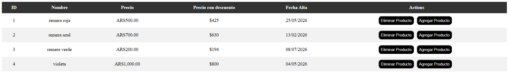
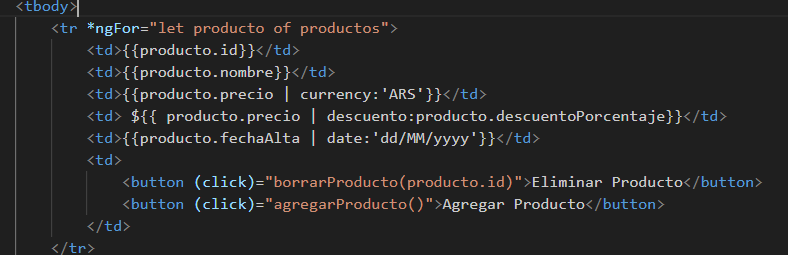
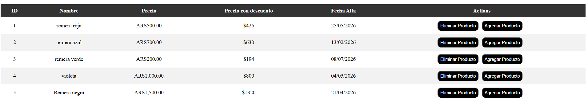
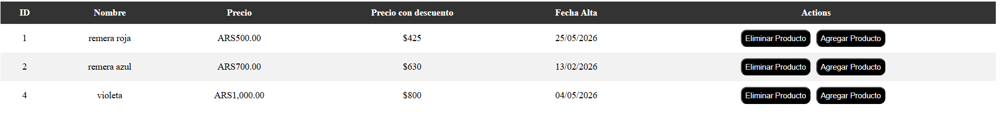

# clase-2-angular

Se crea una tabla con id,nombre,precio,porcentajePrecio(porcentaje de descuento) y fecha.
Se usa *ngFor para iterar productos.
Se usa funciones de service para cargar productos (en el ngOnInit) eliminar y agregar productos.

Instrucciones para iniciar proyecto:

Npm intall para instalar node_modules
ng serve para iniciar proyecto

Screenshots pedidos:

Captura de pantalla con los datos cargados en el front:

Captura de pantalla de codigo html con pipes standards y personalizado:

Captura de pantalla con los productos cargados:

Captura de pantalla con un producto eliminado:

